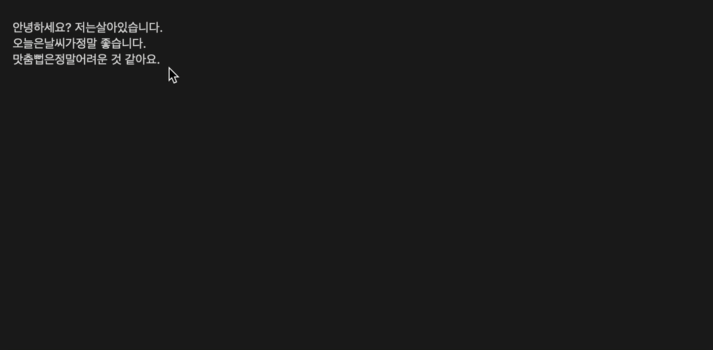

alfhanspell : Naver SpellChecker Workflow for Alfred
==============

Naver SpellChecker Workflow for Alfred

Alfred에서 네이버 맞춤법 검사를 실시하는 워크플로우

Install workflow
--------------
 `NaverSC.alfredworkflow`를 다운로드 받아서 실행한다.

Usage
--------------
* `nsc {query}` {query} 자리에 원하는 문장을 입력하면 맞춤법 수정 결과와 원본 텍스트를 복사하실 수 있습니다.



Build
--------------
```bash
bash ./make.sh
```

Requirements
--------------

* python3
  * [py-hanspell](https://github.com/ssut/py-hanspell.git)
  * [alfred-pyworkflow](https://github.com/harrtho/alfred-pyworkflow.git)
  * requirements.txt

```bash
git submodule update --init --recursive
pip install -r requirements.txt -t workflow/lib
```

LICENSE
--------------
 - MIT
 - except for requests library (Apache License 2.0)


Changelog
--------------

- `v0.0.1`: 공개
- `v0.0.2`: UI 개선 및 파이썬 경로 수정
- `v0.0.3`: 공백 문자 입력 강제를 통한 안정성 향상
- `v0.0.4`: 맞춤법 검사 url 변경
- `v0.0.5`: 맞춤법 검사 결과 공백문자 제거
- `v0.0.6`: `passportKey`가 필요한 문제 임시 해결, `python3` 라이브러리 변경